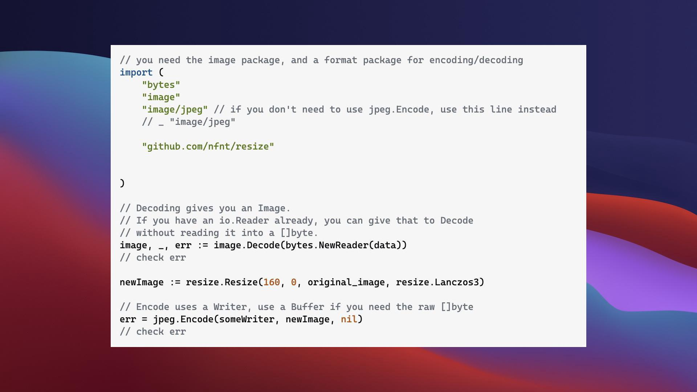
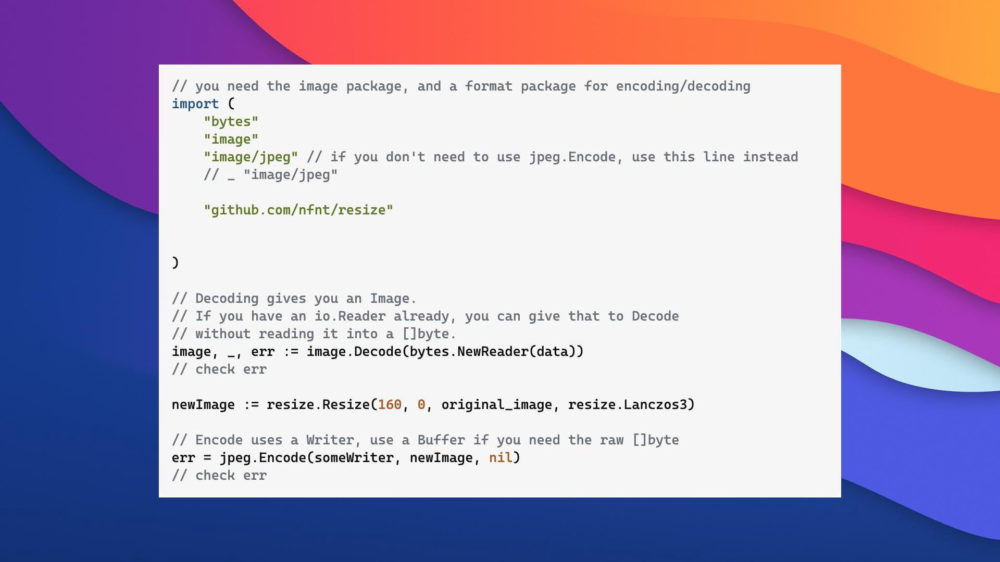

# img-outline

## Usage

### Merge images

```shell
./bin/center/merge-img -front ./testdata/test_jpg.jpg -back ./testdata/macos-big-sur-dark.jpg  -out ./result.jpg
```



```shell
Usage of ./bin/center/merge-img:
  -back string
    	background Image path
  -front string
    	Front image path
  -out string
    	Output Image path
```


### Image outline

```shell
./bin/template/file/img-outline -front ./testdata/test_jpg.jpg -out ./testdata/file_version.jpg
./bin/template/file/img-outline -front ./testdata/test_jpg.jpg -out ./testdata/file_version.jpg -style raycast
```



```shell
Usage of ./bin/template/file/img-outline:
  -front string
        Front image path
  -out string
        Output Image path
  -style string
        Merge style: macos/raycast (default "macos")
```