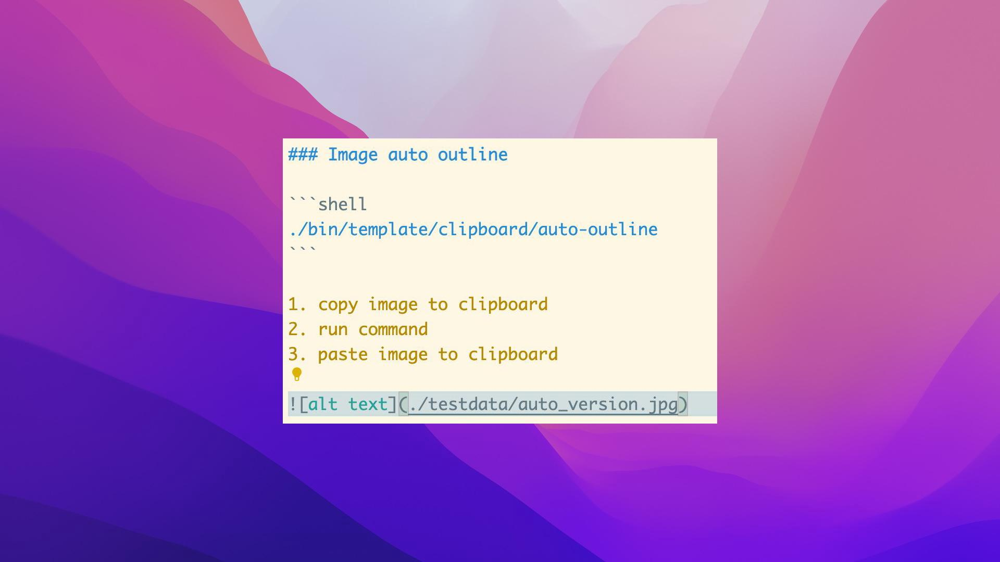
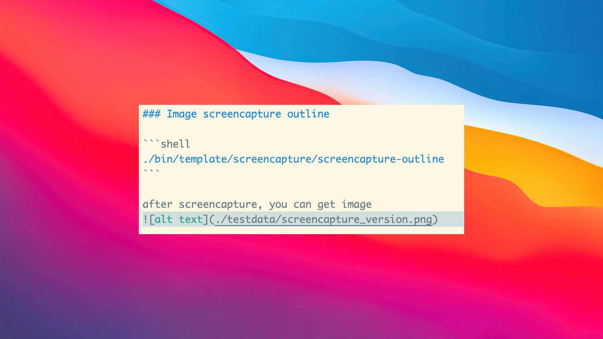

# img-outline

## Usage

### Merge images

```shell
./bin/center/merge-img -front ./testdata/test_jpg.jpg -back ./testdata/macos-big-sur-dark.jpg  -out ./result.jpg
```


```shell
Usage of ./bin/center/merge-img:
  -back string
    	background Image path
  -front string
    	Front image path
  -out string
    	Output Image path
```


### Image outline

```shell
./bin/template/file/img-outline -front ./testdata/test_jpg.jpg -out ./testdata/file_version.jpg
./bin/template/file/img-outline -front ./testdata/test_jpg.jpg -out ./testdata/file_version.jpg -style raycast
```


```shell
Usage of ./bin/template/file/img-outline:
  -front string
        Front image path
  -out string
        Output Image path
  -style string
        Merge style: macos/raycast (default "macos")
```


### Image auto outline

```shell
./bin/template/clipboard/auto-outline
```

1. copy image to clipboard
2. run command
3. paste image to clipboard



```shell
Usage of ./bin/template/clipboard/auto-outline:
  -style string
        Merge style: macos/raycast (default "macos")
```


### Image screencapture outline

```shell
./bin/template/screencapture/screencapture-outline
```

after screencapture, you can get image 



```shell
Usage of ./bin/template/clipboard/auto-outline:
  -style string
        Merge style: macos/raycast (default "macos")
```


## Formore

I will integrate this tool with Alfred, resulting in:

1. more useful
2. more convenient
3. more customizable


## Thanks
1. [gim - Grid Based Image Merge Library](https://github.com/ozankasikci/go-image-merge)
2. [Cross platform (macOS/Linux/Windows/Android/iOS) clipboard package in Go](https://github.com/golang-design/clipboard)
3. [online socialscreenshots editor](https://socialscreenshots.com/editor)
